# Data Collection Application Function and Service Provider Library

## Introduction

A 5G system may have several Application Functions (AFs) which are providing Data Collection services in one form or another.

These Data Collection services usually consist of a Data Collection and storage function and an Event Exposure function which generates events based on the data collected. A standard set of these functions are defined in [3GPP TS 26.532](https://portal.3gpp.org/desktopmodules/Specifications/SpecificationDetails.aspx?specificationId=3915) and [3GPP TS 29.517](https://portal.3gpp.org/desktopmodules/Specifications/SpecificationDetails.aspx?specificationId=3603), and an extended set of these functions for media streaming is defined in [3GPP TS 26.512](https://portal.3gpp.org/desktopmodules/Specifications/SpecificationDetails.aspx?specificationId=3647).

## Service Provider interactions

The standard Data Collection services, from TS 26.532 and TS 29.517, are provided by the Data Collection Service Provider library when the library is in control of the HTTP API interfaces:

```mermaid
sequenceDiagram
autonumber
title Data Collection AF and service provider call flows (SP providing interfaces)

box rgb(255,255,220) User Equipment
participant UE as Direct Data<br/>Reporting Client
end
box rgb(220,255,220) Data Collection
participant AF as Application Function
participant SP as Data Collection library
end
box rgb(220,220,255) 5G Core
participant NRF as Network Registration Function
end
box rgb(255,220,220) 3rd Party Systems
participant AP as Application Provider
end

%% == Start-up ==
note over UE,AP: Start-up
AF ->> SP: Initialise library:<br/>Register known data<br/>reports and event types
SP -->> AF: Library initialised:<br/>True or False
AF ->> SP: Register NF services:<br/>Add library handled services<br/>to NF instance description
SP -->> AF: OK
AF ->> NRF: Register NF Instance
NRF -->> AF: Instance registered
%% == Provisioning ==
note over UE,AP: Provisioning
AP ->> AF: Create Data Reporting Provisioning Session:<br/>Register a session for a given external app id and event type
AF -->> SP: Pass on provisioning session request
SP ->> SP: Validate DataReportingProvisioningSession JSON<br/>and convert to C API data model
break validation failed
SP -->> AP: Error: ProblemDetail indicates the cause of the error
end
SP ->> SP: (C API)<br/>Create provisioning session
SP -->> SP: (C API)<br/>Provisioning session creation result
break session failed
SP -->> AP: Error: ProblemDetail indicates the cause of the error
end
SP -->> AP: OK: Return the provisioning session id in the Location header

AP ->> AF: Create Data Reporting Configuration for the provisioning session:<br/>Includes configuration for sampling, reporting and filtering/aggregation for event exposure
AF ->> SP: Pass on configuration request
SP ->> SP: Validate DataReportingConfiguration
break validation failed
SP -->> AP: Error: ProblemDetail indicates the cause of the error
end
SP ->> SP: (C API)<br/>Add configuration to provisioning session
SP -->> SP: (C API)<br/>Configuration addition result
break configuration failed
SP -->> AP: Error: ProblemDetail indicates the cause of the error
end
SP -->> AP: Configuration added to the provisioning session

%% == Event Subscription ==
note over UE,AP: Event Subscription
AP ->> AF: Register for events<br/>POST /naf-eventexposure/v1/...
AF ->> SP: Pass on event subscription request
SP ->> SP: Validate AfEventExposureSubsc JSON
break validation failed
SP -->> AP: Error: Reason for error in ProblemDetail
end
SP ->> SP: (C API)<br/>Create event exposure subscription
SP -->> SP: (C API)<br/>Event exposure subscription result
break subscription failed
SP -->> AP: Error: Reason for error in ProblemDetail
end
SP -->> AP: OK: event subscription id in Location header

%% == Data Reporting ==
note over UE,AP: Data Reporting
UE ->> AF: Create Data Reporting Session<br/>POST /3gpp-ndcaf_data-reporting/v1/sessions<br/>DataReportingSession
AF ->> SP: Pass on reporting session request
SP ->> SP: Validate DataReportingSession JSON
break validation failed
SP -->> UE: Error: Reason for error in ProblemDetail
end
SP ->> SP: (C API)<br/>Create data reporting session
SP -->> SP: (C API)<br/>Data reporting session result
break session failed
SP -->> UE: Error: Reason for error in ProblemDetail
end
SP -->> UE: Reporting session created<br/>Location header contains the reporting session id
loop Operations according to rules in DataReportingSession
  alt Report Data
    UE ->> AF: Report data<br/>POST /3gpp-ndcaf_data-reporting/v1/sessions/{sessionId}/report<br/>DataReport
    AF ->> SP: Pass on data report submission
    SP ->> SP: (C API) Add data report
    SP ->> AF: (C API - callback) Parse data report
    AF -->> SP: (C API - callback) Parse result
    break on error
        SP -->> SP: (C api) Return error
        SP -->> UE: Error: Reason for error in ProblemDetail
    end
    SP -->> SP: report samples added to database
    SP -->> SP: (C API) Return OK for add data report
    SP -->> UE: OK
    opt If there is a subscription to an event that uses this report type
        SP ->> AF: (C API)<br/>Generate event notifications<br/>for event subscription
        AF ->> SP: (C API)<br/>Get bucketed reports: passes some filtering information
        SP -->> SP: collect samples from database
        SP -->> SP: bucket samples for aggregation
        opt if sample needs apportioning for the bucket
            SP ->> AF: (C API - callback)<br/>Proportion record
            AF -->> SP: (C API - callback)<br/>Proportioned record
        end
        SP ->> AF: (C API - callback) Aggregate samples for each bucket
        AF ->> SP: (C API)<br/>Apply aggregation to sample values
        SP -->> AF: (C API)<br/>Aggregated result
        AF -->> AF: Create new data sample record with aggregated results
        AF -->> SP: (C API - callback) Aggregated sample(s)
        SP -->> AF: (C API) Return bucketed aggregated samples
        AF -->> AF: Convert bucketed samples into event exposure notifications
        AF -->> SP: (C API) Return generated event notifications
        SP ->> AP: Send event notifications
    end
  else Refresh Data Reporting Session
    UE ->> AF: Retrieve Data Reporting Session<br/>GET /3gpp-ndcaf_data-reporting/v1/sessions/{sessionId}
    AF ->> SP: Pass on get request for DataReportingSession
    SP -->> UE: 200 OK<br/>DataReportingSession
  end
end

%% == End Data Reporting ==
note over UE,AP: End Data Reporting
UE ->> AF: Destroy Data Reporting Session<br/>DELETE /3gpp-ndcaf_data-reporting/v1/sessions/{sessionId}
AF -->> UE: 204 No Content
%% == End Event Subscription ==
note over UE,AP: End Event Subscription
AP ->> AF: Destroy Event Subscription<br/>DELETE /naf-eventexposure/v1/...
AF -->> AP: 204 No Content
%% == End Data Reporting Provisioning Session ==
note over UE,AP: End Data Reporting Provisioning Session
AP ->> AF: Destroy Data Reporting Provisioning Session<br/>DELETE /3gpp-ndcaf_data-reporting-provisioning/v1/sessions/{sessionId}
AF -->> AP: 204 No Content
```

Alternatively an AF, such as the 5GMS AF, may wish to provide provisioning and reporting APIs itself. In this case the AF uses the C function calls in the Data Collection Service Provider library to register session and configurations, store data report samples and generate events for exposure to the MWDAF or interested 3rd parties.

```mermaid
sequenceDiagram
autonumber
title Data Collection AF and service provider call flows (AF providing interfaces)

box rgb(255,255,220) User Equipment
participant UE as Direct Data<br/>Reporting Client
end
box rgb(220,255,220) Data Collection
participant AF as Application Function
participant SP as Data Collection library
end
box rgb(220,220,255) 5G Core
participant NRF as Network Registration Function
end
box rgb(255,220,220) 3rd Party Systems
participant AP as Application Provider
end

%% == Start-up ==
note over UE,AP: Start-up
AF ->> SP: Initialise library:<br/>Register known data<br/>reports and event types
SP -->> AF: Library initialised:<br/>True or False
AF ->> SP: Register NF services:<br/>Add library handled services<br/>to NF instance description
SP -->> AF: OK
AF ->> NRF: Register NF Instance
NRF -->> AF: Instance registered
%% == Provisioning ==
note over UE,AP: Provisioning
AP ->> AF: Create Provisioning Session
AF -->> AP: Provisioning session creation success/failure
AP ->> AF: Create Data Reporting Configuration for the provisioning session:<br/>Includes configuration for sampling, reporting and filtering/aggregation for event exposure
AF -->> AF: Validate the reporting configuration
break validation failed
AF -->> AP: Error: ProblemDetail indicates the cause of the error
end
opt First time reporting is configured
loop For each event type the AF handles
AF ->> SP: (C API)<br/>Create provisioning session:<br/>Provide the external_app_id and event type
SP -->> AF: (C API)<br/>Provisioning session creation result
AF -->> AF: Remember the created provisioning session
end
end
AF ->> SP: (C API)<br/>Add configuration to provisioning session
SP -->> AF: (C API)<br/>Configuration addition result
break configuration failed
AF -->> AP: Error: ProblemDetail indicates the cause of the error
end
AF -->> AP: Configuration added to the provisioning session

%% == Event Subscription ==
note over UE,AP: Event Subscription
AP ->> AF: Register for events
AF ->> AF: Validate event subscription
break validation failed
AF -->> AP: Error: Reason for error in ProblemDetail
end
AF ->> SP: (C API)<br/>Create event exposure subscription
SP -->> AF: (C API)<br/>Event exposure subscription result
break subscription failed
AF -->> AP: Error: Reason for error in ProblemDetail
end
AF -->> AP: OK: event subscription id in Location header

%% == Data Reporting ==
note over UE,AP: Data Reporting
UE ->> AF: Create Application Session
AF ->> AF: Validate Application Session
break validation failed
AF -->> UE: Error: Reason for error in ProblemDetail
end
AF -->> UE: Application Session created<br/>Location header contains the session id<br/>Reporting parameters in body

loop Operations according to rules in Application Session response
  alt Report Metrics Data
    UE ->> AF: Report data
    AF -->> AF: Parse and validate report
    break on error
      AF -->> UE: Error: Reason for error in body
    end
    opt First report from this UE client
      AF ->> SP: (C API)<br/>Create data reporting session
      SP -->> AF: (C API)<br/>Data reporting session result
      break session failed
        AF -->> UE: Error: Body indicates failure to record metrics
      end
      AF -->> AF: Store the data reporting<br/>session in the application session
    end
    AF ->> SP: (C API)<br/>Store data report samples
    SP -->> SP: report samples added to database
    SP -->> AF: (C API)<br/>Storage result
    break on error
      AF -->> UE: Error: Failed to store metrics
    end
    AF -->> UE: OK: Metrics stored
    opt If there is a subscription to an event that uses this report type
        SP ->> AF: (C API)<br/>Generate event notifications<br/>for event subscription
        AF ->> SP: (C API)<br/>Get bucketed reports: passes some filtering information
        SP -->> SP: collect samples from database
        SP -->> SP: bucket samples for aggregation
        opt if sample needs apportioning for the bucket
            SP ->> AF: (C API - callback)<br/>Proportion record
            AF -->> SP: (C API - callback)<br/>Proportioned record
        end
        SP ->> AF: (C API - callback) Aggregate samples for each bucket
        AF ->> SP: (C API)<br/>Apply aggregation to sample values
        SP -->> AF: (C API)<br/>Aggregated result
        AF -->> AF: Create new data sample record with aggregated results
        AF -->> SP: (C API - callback) Aggregated sample(s)
        SP -->> AF: (C API) Return bucketed aggregated samples
        AF -->> AF: Convert bucketed samples into event exposure notifications
        AF -->> SP: (C API) Return generated event notifications
        SP ->> AP: Send event notifications
    end
  else Refresh Application Session
    UE ->> AF: Retrieve Application Session
    AF -->> UE: OK: Updated Application session in body
  end
end

%% == End Data Reporting ==
note over UE,AP: End Data Reporting
UE ->> AF: Destroy Application Session
AF -->> UE: 204 No Content
%% == End Event Subscription ==
note over UE,AP: End Event Subscription
AP ->> AF: Destroy Event Subscription
AF -->> AP: 204 No Content
%% == End Data Reporting Provisioning Session ==
note over UE,AP: End Provisioning Session
AP ->> AF: Destroy Provisioning Session
AF -->> AP: 204 No Content
```

